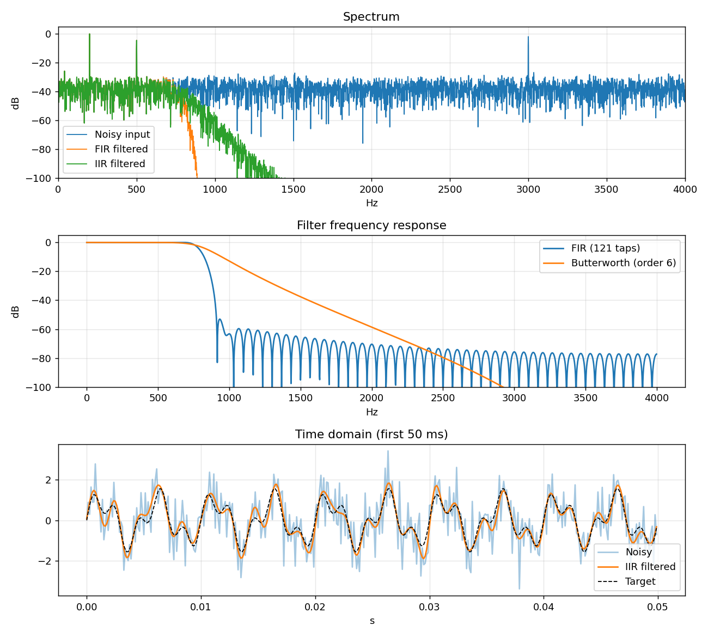

# SignalLab 📡

A compact Python toolkit for **digital filter design and spectrum analysis**, built as an ECE project for my research lab.
It generates noisy multi-tone signals, designs FIR (windowed-sinc) and IIR (Butterworth) filters,
and measures how much each one improves signal-to-noise ratio (SNR).



## Results

A 200 Hz + 500 Hz signal buried in white noise plus a 3 kHz interferer (input SNR ≈ 0.3 dB)
is cleaned up by a low-pass filter at 800 Hz:

| Signal          | SNR vs. wanted tones |
|-----------------|----------------------|
| Noisy input     | 0.27 dB              |
| FIR (121 taps)  | 10.59 dB             |
| IIR (Butterworth, order 6) | 10.63 dB  |

## Features

- Multi-tone signal generator and white-noise injection at a target SNR
- FIR design via windowed-sinc (`scipy.signal.firwin`) and Butterworth IIR design in SOS form
- Zero-phase (forward-backward) or causal filtering
- Frequency response in dB and Hann-windowed FFT spectrum
- Unit tests with `pytest`

## Quick start

```bash
git clone https://github.com/SuhaniShah008/signallab-ece.git
cd signallab-ece
python -m venv .venv && source .venv/bin/activate   # Windows: .venv\Scripts\activate
pip install -r requirements.txt
python demo.py        # prints SNR results and writes docs/demo.png
pytest                # run the tests
```

## Project structure

```
signallab/
  signals.py    # tone generation, noise injection
  filters.py    # FIR/IIR design, filtering, frequency response
  spectrum.py   # FFT spectrum, SNR measurement
tests/          # pytest suite
demo.py         # end-to-end denoising demo
```

## Ideas for extending it

- Add band-pass / notch filters and a Chebyshev or elliptic option
- Add an adaptive LMS filter for noise cancellation
- Stream audio from a microphone and plot a live spectrogram
- Port the FIR filter to Verilog and verify against this Python reference

## License

MIT
